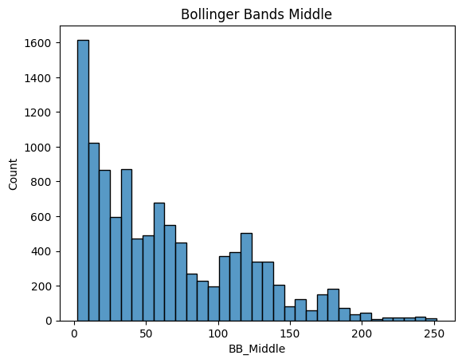

# 2025_ia651_kay
## Predicting Toyota Corporation's Closing Stock Price

### Describe the dataset used.

In this project, I have a wide range of factors in order to attempt to create an accurate model to predict the closing stock price for Toyota Corporation. All of the fields were obtained from different sources, in which I compiled all of them into one big dataset. All of the fields are explained below. All price data is in US Dollars, with the exception of the Nikkei225 index, which is in yen.

Field | Explaination of what it is and why its used | Source
---------- | -------------------------------| --------------------
Adjusted Close (Response Variable) | This is the response variable. The adjusted close is different from the actual close in that it accounts for stock splits/reverse splits, dividends, and rights offerings or other various corporate actions. We are attempting to use all information from the previous day in order to forecast the closing price of the current day (or next day). | Yahoo Finance
Close | This is one of the factors used in prediction. This is the closing price of Toyota's stock. The closing price of Toyota can be used to forecast the adjusted close the following day. | Yahoo Finance
High | This is the high price of the Toyota stock during the trading session. This along with the low price (the next factor), are helpful to get the trading range of the stock for the session, which is good to know when predicting forward. | Yahoo Finance
Low | This is the low price of the stock in the trading session. As said before, this metric helps with capturing the days trading range. | Yahoo Finance
Open | This is the open price of the trading session. As with all price data, this along with the interactions between other price data can help identify patterns with price movements. | Yahoo Finance
Volume | This is how many shares of Toyota were traded in the trading session. Higher trading days are typically because of a information event that came out. As an example, if Toyota released they are building a new production plant and trading volume goes up. | Yahoo Finance
fed_funds_effective_rate | This is an important macroeconomic metric, which shows the rate at which banks lend to each other overnight. This is a weighted average. This is the benchmark short-term interest rate and influences many other interest rates like mortage rates, treasury yields, and more. This gives an idea of how the economy is doing. | fred.stlouisfed.org
T10Y2Y | This is another important macroeconomic indicator, which is the 10-year treasury constant maturity minus the 2-year treasury constant maturity. This is a very important leading indicator for regessions in the market. When the number inverts (becomes negative), this is an indication of a coming recession. Overall, this metric gives an idea of the health of the economy. | fred.stlouisfed.org
nikkei225_close_in_yen | Since Toyota is Japanese company, headquartered in Japan, the health of the Japanese markets are also important to include. If the economy in Japan is struggling, how does that effect Toyota? This is why I have included the closing trading price of the Nikkei225 index. This factor is in Japanese Yen. | www.macrotrends.net
japan_basic_discount_loan_rate | This factor is the Basic discount rates and basic loan rates (previously called "offical discount rates"). These rates act as an upper limit for uncollateralized transactions for lending and borrowing short term funds, in the financial market. Again, since Toyota is a Japanese company, I wanted to include macroeconomic data from Japan, not just the US. | Bank of Japan

##### Value in This Prediction Model

The models being trained in this project have the goal of predicting the closing price of Toyota Corporation's stock. This prediction, if proven to work, could be very valuable. Being able to predict the closing price of a stock would give you the information needed in order to invest and make money down the road. In production, this could be used at investment firms, hedge funds, institutional investors, or even the individual. In this project specifically, I have lagged the target variable by 1 day, meaning the closing price prediciton is for 1 day in the future. This model would be geared more to short-term trading (day trading) rather than long-term investing. 

### Process overview

First for this project, which was most important, was gathering the proper data to use. This data, as explained above, was gather from multiple different sources. Once I gathered the data from credible sources and confirmed the validity of it, I started exploring the data. This icluded looks at distributions, means, standard deviations, correlations of variables, along with adding in more financial indicators. Then I plotted the ACF and PACF. This is useful for determining the correlation between data points at different lags. The PACF isolates this relationship between the data points and its lagged values after removing the effects of the correlations at shorter lags. These graph are used to show at what lag durations that they are still statistically significant. After interpreting these graphs, I was able to determine to lag the target variable by 1 day. Now, I was ready to run models with the statsforecast package. Since these packages require a dataframe that is formatted a particular way, I went ahead and altered the existing dataframe. Following running these models, I ran the XGBoost Regressor, which did not run the way I needed it to. Since the test data was outside of the range of the test data, the model did not work as planned. I tried to pivot and use differencing and scale the data as well. After interpreting the results, this did not work as well. So, from here, I moved on and attempted to create an RNN. 

### EDA 
As explained above, I have showed the the main chunk of my X variables, along with my Y variable. Through the EDA process, I added a few more X variables. These variables are more financial indicators, along with moving averages. The variables are explained in the table below: 

Variable | Why It's Included 
---------- | -------------------
MA_5_adj_close | This is the 5 day moving average of the adjusted close. This is included and very important because in forecasting stock prices, the moving average smooths the target variable out to show trend. This is important because there is a lot of noise in price data, so smoothing the data out to show a trend is very important.
5_day_SD | This is the 5 day standard deviation of the adjusted close. It is very important to measure volitility when forecasting prices. Higher volitility means bigger potential for gains and losses.
RSI | Known as the relative strength index. This measures the speed and momentum of price movements. Knowing this value is very important for predicting prices. According to industry norm, an RSI of 70 or over means that the stock is overbought and could be heading towards a reversal to the downside, while an RSI of 30 or less means it is oversold and could be heading toward a spike in price.
MACD | Stands for Moving Average Convergence Divergence. This shows the relationship between 2 moving average lines. It is calculated by taking the fast moving average and subtracting it from the slow moving average, which is 5 and 15 respectively. This is another trend and momentum indicator. Lastly, when the MACD diverges from normal price action this can indicate either a buy or sell action.
Signal_line | This is created by taking the exponential moving average of the MACD. The signal line on its own doesn't say much, but in conjuction with the MACD, crossovers are an important indicator. If the MACD crosses the signal line on the upside, this is a buy indicator, while vise versa is a sell indicator. 
BB_middle | This is called the Bollinger Bands, along with the upper and lower indicators. The middle line is a simple moving average of the target variable, in this case it is the 7 day SMA. The implications of this line along with the upper and lower bands will be explained below.
BB_upper & BB_lower | These lines are created by taking the middle band +- 2 standard deviations. These bands show volitility, with wider bands having high volitility and vise versa. These also show overbought and oversold signals with how close the middle band gets to the upper or lower bands. Lastly, it confirms trend strength or momentum by how close the middle band is to the outer bands.

As explained above, this is a classic regression problem, with predicting a continous price as an output. This dataset has has 11,291 observations going back to 1980, with the final dataframe with all financial indicators having 25 features. 

#### Distributions

In this dataset, most features are price information, which means that they are skewed. Here are a few examples: 

This is important to know when going through EDA. With the first models like Holt Winters, GARCH, AutoARIMA, Historic Average, Dynamic Optimized Theta and Seasonal Naive, they are not tied to a normality assumption, so its not a big deal with these models. Also, with XGBoost and RNNs, they are not tied to a  normality assumtion either. 

The distrubution of Y, like the other variables, is a price and is skewed as shown below.

#### Correlation

Some of these features being used are strongly correlated with each other. The price data for Toyota (ie High, Open, Low, Close, and lagged Target Variable), are all strongly correlated with each other. Also, the derived financial indictors are all strongly correlated with the variables they were derived from (ie moving averages, standard deviations, Bollinger Bands, RSI, MACD, and Signal Line). Multicolinearity, once again with the models being used, it doesn't affect the results too much. These are robust models that are meant for analyzing time series data with a lot of noise. Below is the correlation plot.

#### Feature importance

With the statsforecast models that I ran, these are all univariate models, meaning all it used was the target variable along with the date. This means feature importance is not applicable with the models. This focused on the main components of a time series dataset; trend, seasonality, cyclicality, and irreducible error. With XGBoost, I first ran the model with all features. The reason why I used all features in the XGBoost regressor is becasue it chooses features based on how important they are and their effect on the error. I let the model decide what features to use. Because of other problems with using XGBoost, I decided to change course from here and focus on the RNN. Finally with the RNN, feature importances are tough to isolate in a complex model like this. The RNN model I ran isolated the target variable much like the statsforecast models. 

#### Feature engineering

For feature engineering, the weekday variables are one hot encoded. These were done in excel then one hot encoded later. The biggest feature engineering done in my dataset was with the financial variables as seen above. These financial indicators were either derived from other features, or I used the package `pandas_ta` in python with has functions to produce all of these indicators. One very important step in time series data is using data that is available to you at the time of prediciton. This is why I lagged my target varaible by one day. I created a new column for the target variable called `TargetAdjClose`. This is the same values as `AdjClose` but lagged one day. I did it this way because I could use the adjusted close from the previous day to predict the adjusted close today. 

### Model fitting
#### Train / test splitting

The train/test split was done by splitting on a particular static date, which was 2016-01-01, for the statsforecast models. I calulated around 80% of the data to be in the train data.

For my XGBoost model, I used the TimeSeriesSplit() in sklearn. This makes n number of slpits, and in my model, n=5. Lastly, for the RNN, I used df.loc() with date rangles for the train data, validation data, and test data. For all of these different splits, this ensures no data leakage. My biggest problem with data leakage came from lagging the target varaible the wrong way. This exposed the the model to future data that it was not supposed to see. After I noticed this I fixed it and in re-ran all models. 

#### Model Selection

For this project, I have ran a multitude of models. First, out of the statsforecast models, I ran baseline models like Historical Average and Seasonal Naive. Then moving into more robust univariate models, I ran Holt Winters, AutoARIMA, GARCH and Dynamic Optimized Theta. Holt Winters is just Triple exponential smoothing (taking into account level, trend and seasonalilty). Dynamic Optimized Theta decomposes the time series into theta lines and combines their forecasts. AutoARIMA, which is autoregressive integrated moving average, is very good with time series data. Finally, I used GARCH as well. This model stands for Generalized Autoregressive Conditional Heterskedasticity, and it forecasts something a little different. This forecasts the volility of the dataset. As talked about before, volility is crutial in finance for its risk management. Next, I ran an XGBoost regressor model. These types of models are great for time series data because they can capture non-linear relationships and complex patterns. This is also a multivariate model, which I wanted to test and see how this model did. These models are very robust and can handle the stochastic nature of stock data. When this didn't go as planned, I trained an RNN. This type of neural network is great a capturing the sequential nature of the data. This is important since the order of points matter. The thought process in running the models in this order is that the first models capture a lot of information about the target variable. After that, I ran the more robust models capable of handling multivariate data to compare results with the "baseline" statsforecast models. 

#### Hyperparameter Testing 

For the XGBoost model, I used grid search for the hyperparameters. The grid search included many hyperparameters including `max_depth`,`min_child_weight`,`early_stopping_rounds`,`alpha`,`n_estimators`,and `eta`.

For the hyperparameters in the param_grid, this is what was changing the most. The alpha, n_estimators, and eta were all in the param_grid at first but they wouldn't change much so I took them out of the param_grid and set them equal to a constant to save some time training the model. This was were most of the time was spent, tuning these hyperparameters to try to minimze overfitting. 

### Validation / metrics
Give 2-4 prediction examples from your data.
Give 2 prediction examples which are new or synthesized. 

For all the models I ran, I used root mean squared error (RMSE). I wanted to keep this metric consistent to compare model to model. The best of the statsforecast models was the AutoARIMA model, which had an RMSE of 27.18. Since the mean of the of the target variable is 63.57 with a standard deviation of 52.26, this shows that there is a significant amount of error in this model. The average prediciton error of the model is 42.76% of the mean and 52.01% of the standard deviation, which is significant.  Below is the table of all models and the RMSE.

Model | RMSE
------ | --------
Holt Winters | 39.43
AutoARIMA | 27.18
GARCH (Forecasting Volility so a little different) | 149.85
Seasonal Naive | 39.70
Historic Average | 106.11
Dynamic Optimized Theta | 27.40 

Predictions table for the above models (in US Dollars): 

Date | Actual Price | Holt Winters | GARCH | AutoARIMA | Seasonal Naive | Historical Average | Dynamic Optimized Theta
---- | -------------| ------------- | ------| --------- | --------------| -------------------| ------------------------
2016-01-04 | 118.95 | 121.59 | -29.53 | 119.22 | 121.73 | 43.27 | 119.06
2016-01-05 | 117.42 | 120.33 | 23.95 | 119.39 | 121.56 | 43.27 | 119.14

Next, for the XGBoost Regressor model, I ran this through 5 differnt time series splits. Across the 5 different time series splits, here are the errors. 

Split # | Train RMSE | Test RMSE 
----------- | ---------| ------------
1 | 0.09 | 7.09
2 | 0.16 | 15.73
3 | 0.36 | 9.99
4 | 0.49 | 9.78
5 | 0.58 | 34.41
Average | 0.34 | 15.40

Predicitons for the XGBoost Regressor Model (in US Dollars)

Date | Actual Price | Predicted Value
----------- | ---------| ------------
2017-07-13 | 109.87 | 109.04
2017-07-14 | 109.84 | 109.12
2017-07-17 | 110.20 | 110.27

As you can see with this model, there is an extreme overfitting problem. I spent a lot of time trying to tune hyperparameters to tone this down, but it did not work. The `max_depth` hyperparameter ensures that the tree does not get too complicated and trying to get all leaf nodes to a gini impurity of 0. Limiting this to 2-4, as in the grid search, really ensures these trees don't get too deep. `Early_stopping_rounds` also helps mitigate overfitting. This will stop the model if the validation set stops improving. The reason why it didnt work is becasue with the test data, it was outside the range of the train data. So when it would make predicitons, the model wouldn't go above the level of data points previously seen. This is shown in the graph below.

Becasue of this, I tried to add in differencing and scaling. This would attempt to minimize the problem as seen above, but this did not work. The average RMSE train was 0.006 and the average RMSE test was 0.016. While, at face value it looks to have fixed it, this is becasue the RMSE metric is in the scaled units, so this model was still overfitting with the same problem.

After I extensively worked with XGBoost, I changed course and trained a RNN model. This RNN model, I trained with just the target variable. This was to see how it would compare to the first statsforecast models I ran. First I set the sequence length to a few different values (this probably could have been put in a grid search but I only tried 7, 14, 56). Again, I used RMSE as a metric for this model to be able to compare to the past models. After I ran the base model, with just 1 dense layer (output). This model had train RMSE of 1.28 and validation RMSE of 3.46. This really showed promising output for these. After that, I trained my deep model with 1 SimpleRNN layer, 2 LSTM layers, 2 Dropout layers and an output layer. I tried many variations of this with mainly the same outcome. The train RMSE was 5.73 and the validation RMSE was 33.7. Again, this model shows overfitting and not generalizing well to new and unseen data. 

### Production

After going through many differnet models with this data, both univariate and multivariate, none of the models provided good enough results to be put into production. Stock prices are very difficult to forecast, as this project proved that. This will need more work in order to make a production model. Maybe new data, different model, etc. The best model that was produced was probably the AutoARIMA model. With that being said, this model still had RMSE of 27.18, so this is still not advised to use to forecast stock prices. For the XGBoost Regressor, the target variable is lagged by 1 day. This means the prediction is for 1 day out. 

### Going further

Moving forward, I would like to work more with the XGBoost Regressor. This model did extremely well when the data was in range of the train data, but once it went outside that range, it fell apart. If I could figure out a way to do this, this model would perform exceptionally. I would like to train more neural networks. Maybe try a CNN or make the RNN more robust with using all of the features. Also, I would like to look into using more LSTM layers (even though I did include them in my RNN). With the amount of noise in stock prices, it makes it difficult to accurately forecast. This is why the Holt Winters Model, along with the AutoARIMA were the best 2 model that I make. Smoothing out the noise into a trend line, and getting rid of seasonality and cyclicality proved to be the best way to go about this (going back to the 4 parts of a time series dataset). I would also be interested in seeing how SVM's work for this type of project. I have read research articles that incorporate these models and they have done decently well. With the data i had selected, I tried to make my features well rounded. The reason for this is because you cannot solely use historical prices to forecast future prices. I wanted to see if there were deeper trends with macroeconomic factors, not just in the US, but in Japan as well since Toyota is headquartered there. Also, I added in the VIX index to get a sense of investor sentiment. Overall, I learned a lot about the process of forecasting time series data, though doing this with stock prices is extraordinarily difficult. 
